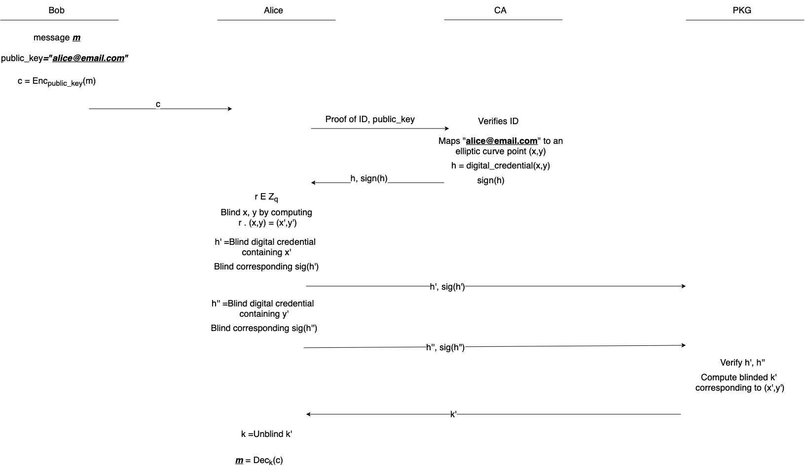
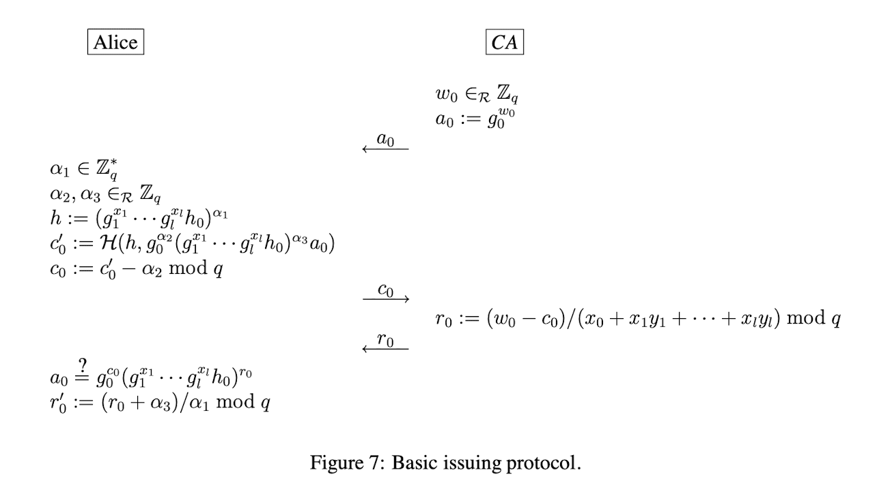

# Honours Project 2022
---
## Blind Signatures In Identity Based Encryption

#### **Goal**
The goal of this project is to provide a Proof of Concept variation of Identity Based Encryption that implements a Certificate Authority as a middleman to dispense digital credentials to each user so that they may blind their attributes when passing them to the PKGWrapper to remove the security issue of the PKGWrapper being able to decrypt every user's ciphertext. The rough outline of the Proof of Concept for this implementation will be outlined below.

---

#### **Implementation**
The implementation will be done within a single project/application in Java, LTS version 11. The java project will be built via Maven to include dependencies from the Crytpid-Java Github repository. The project will be separated into classes largely based on use in the encryption scheme, but some helper and/or wrapper classes will be included also. The classes are roughly explained below.

##### CA
>A Certificate Authority class, it is used to issue certificates to users for digital credentials. In this use case it will only issue credentials for a point where the user's attribute exists on an elliptic curve. Along with this, for the sake of simplicity, the Certificate Authority will not require proof of identity for the proposed attributes. The CA class will implement several important functions for things such as: generating system parameters, a handshake function for establishing contact with the client, a function for calculating a client's digital credential, and several functions for communicating with the PKGWrapper and confirming a user's identity. The CA class will only interact with the PKGWrapper and Client classes directly, but will implement both the Key and Certificate classes.

##### PKGWrapper
>A Private Key Generator Class, it is used to communicate with clients for access to their private key to decrypt a message, and communicates with the CA class to verify the identity of a user requesting a private key. The PKGWrapper will largely be implemented via the Cryptid-Java library, but several conditional additions will be made via wrapper functions. One such example will be verifying a users identity via the CA class. This means that there will be very few implemented functions in our class. The PKGWrapper class will also implement the Key class, and will make use of the Certificate class very briefly.

##### Client
>A Client class used for encrypted communication between users. Once more the client is largely implemented via the Cyrptid-Java library, but several conditional additions via wrapper functions. These will largely handle communication with the CA, and passing values to the PKGWrapper. The role of the user class is mostly for testing and proving conceptual ideals, so it is relatively important in terms of use.

---

# Installation

To install this program and its dependencies. Run the following command in this folder 

> mvn install

Then navigate to `target/classes/` and run

> java Testing

to run the test program.

## **TODO**

- [x] Create High-Level Design diagram
- [ ] Define Key and Certificate classes
- [ ] Create UML diagrams for each class
- [ ] Begin implementation of CA and communication with user class
- [ ] Edit PKGWrapper source class to allow for proof of identity via digital credentials

## High-Level Architecture Diagram

The following diagram represents a High-Level overview of the goal of this project:

## System-Wide Parameters

- q (prime number) = 123766290236648576999305319065597697947 (128 bit)
- Generator for cyclic group of prime order q can be made from a coprime/ number p that is less than q
  - A group of prime order is cyclic.
  - By the euler totient function, we have q-1 choices of generators.
- Java BigInt library for dealing with large numbers.
- SHA256 as Hash Function.
- All numbers will be handled in hexadecimal, most likely including predetermined prime numbers used as well

### Next Steps

1 thing at the time :)

- [x] Construct Alice and CA classes first!

### Issue Protocol Test

For the sake of testing, the initial iteration of the issue protocol will have the following parameters:

- q = 11
- g_0 = 3
- y_1 = 7 - used to generate g_1 
- x_0 = 8 - used to generate h_0

The issue protocol will be in accordance to Brand's paper.

### Blinding the Credential

> Alice multiplies P by a random integer r to give a new point P' = rP = (x', y').  Alice can find r_x and r_y such that x' = (r_x)x.  Similarly, she can find r_y such that y' = (r_y)y.  Therefore, Alice can take her credential C = g1^x . g2^y . h0^alpha and blind it to C_x = C^(r_x) = g1^x' . g2^(r_x)y . h0^(r_x)alpha.  Similarly, she can blind C to C_y = C^(r_y) = g1^(r_y)x . g2^y' . h0^(r_y)alpha.  (As I mentioned, she needs to create both these blinded credentials because there is not a single value that she can raise C to that will correctly modify both x and y.)